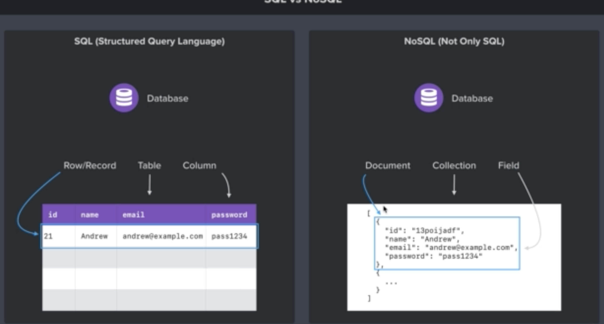

MongoDB는 대표적인 비관계형 데이터 베이스(NoSQL)다. Postgres나 MariaDB 같은 관계형 데이터 베이스(SQL)만을 사용해 본 상황에서 MongoDB같은 NoSQL을 쓸 일이 생겨 둘 사이의 차이를 한번 정리해 보고자 한다.

### SQL

**데이터를 테이블의 형태로 저장한다.**

테이블의 각 columm 별로 구분하는 이름이 있고 각 row와 columm이 교차하는 곳에 해당하는 정보가 표현된다.

하나의 행을 row나 record라고 부르며 정보가 담긴 테이블을 Table이라 부르고 열을 columm이라고 부른다.

**엄격한 데이터구조를 가지고 있다.**

데이터 구조를 스키마라 한다. 관계형 데이터베이스에서 스키마를 준수하지 않는 레코드는 추가할 수 없다. 해당 row나 record는 반드시 요구되는 모든 필드의 값들을 가지고 있어야 한다. 더 있어도 안되고 모자라도 안된다.

**관계성을 가지고 있다**
데이터를 여러개의 테이블에 나누어 담아 데이터 중복을 피할 수 있다. 각 테이블에 독립적인 데이터를 담고 해당 데이터들의 관계를 나타내는 칼럼을 추가하면된다.

하나의테이블에서 중복없이 하나의 데이터를 관리하는 구조 덕분에 부정확한 데이터를 다룰 위험이 없다.

### NoSQL

데이터를 JSON과 비슷한 형태로 저장한다.

한 묶음의 데이터를 document라 하고 그 데이터 안의 내용물을 field라 한다. 이 묶음 데이터의 묶음을 collection이라고 한다.

**데이터구조가 없다.**
정해진 스키마를 따르지 않아도 collection에 데이터를 추가할 수 있다.

**관계가 없다.**
관련 데이터를 동일한 collection에 담는다. 여러 테이블을 join할 필요 없이 이미 필요한 모든것을 갖춘 문서를 작성하게 된다. 때문에 복잡하고 느린 join을 사용할 필요가 없다는 장점이 있다.

데이터가 중복되기 때문에 불안정한 측면이 있다. 같은 데이터중 한쪽만 업데이트 되고 다른쪽에서는 업데이트가 안될 수 도 있기 때문이다.

일반적으로 관계를 맺고 있는 데이터가 자주 변경되는 경우나, 명확한 데이터 스키마가 사용자와 데이터에게 중요한 경우, SQL을 쓰는 것이 좋다.

반면, 데이터 스키마가 변경, 확장될 수 있는경우, 자주 데이터를 읽어오지만 변경하지는 않는경우, 데이터베이스를 수평적으로 확장해야 하는경우에는 NoSQL을 사용하는 편이 좋다.

참고 사이트:

- [SQL vs NoSQL (MySQL vs. MongoDB)](https://siyoon210.tistory.com/130)
- [The Complete Node.js Developer Course](https://www.udemy.com/course/the-complete-nodejs-developer-course-2/learn/lecture/13729148?start=15#content)
